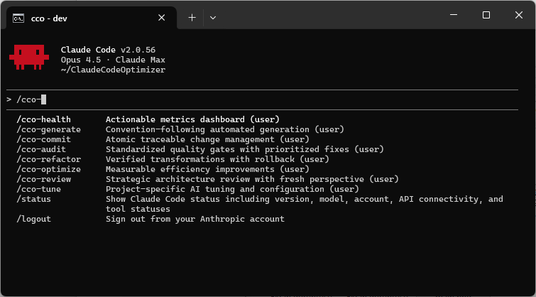
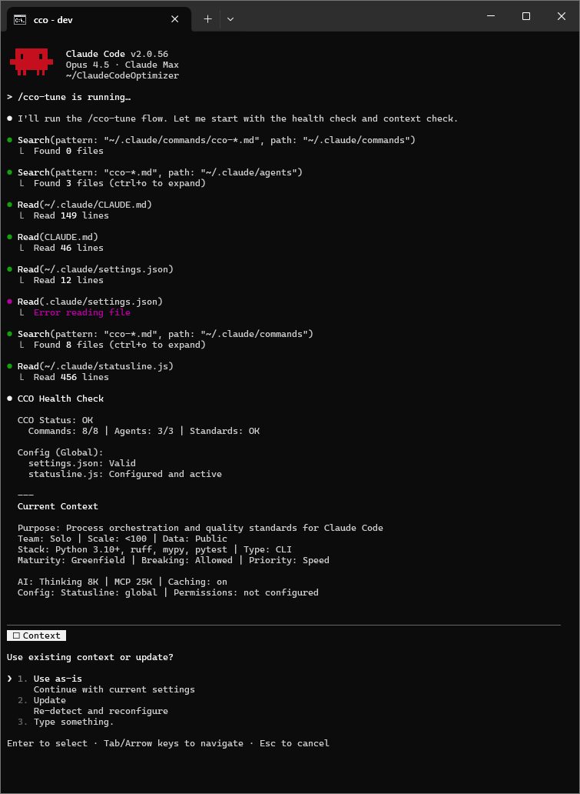

# ClaudeCodeOptimizer

A process and standards layer for Claude Code in the Opus 4.5 era.

[](https://www.python.org/downloads/)
[](LICENSE)
[](https://pypi.org/project/claudecodeoptimizer/)
[](https://platform.claude.com/docs/en/build-with-claude/prompt-engineering/claude-4-best-practices)

> **Fully aligned with [Claude 4 Best Practices](https://platform.claude.com/docs/en/build-with-claude/prompt-engineering/claude-4-best-practices)** - Agentic coding, extended thinking, parallel tools, context management, and design quality standards.


*ClaudeCodeOptimizer lives directly inside Claude Code + Opus 4.5, no extra UI.*

**TL;DR**
- Thin layer on top of Claude Code + Opus 4.5
- Three-layer standards (universal, Claude-specific, project) shaping all Claude workflows—not just `/cco-*` commands and agents
- Risk-based approval flow, no silent changes

---

Claude Code already gives you strong refactors, tests and multi-file edits with Opus-class models.
CCO sits on top of that and adds three things you usually have to build by hand:

1. **Project-aware tuning** with a single `/cco-tune` flow that writes your context and AI settings into `CLAUDE.md`
2. **Standards-driven commands** that all read from one shared `cco-standards.md` file
3. **Risk-based approval flow** so no change is applied silently and git safety checks are always part of the workflow

No servers, no dashboards, no extra dependencies. Just a thin standards layer on top of the tools you already use every day.

---

## Requirements

- **Python 3.10+** (tested on 3.10, 3.11, 3.12, 3.13, 3.14)
- **Claude Code** - CLI or IDE extension
- **Zero Python dependencies** - uses only Python standard library

## Quickstart

```bash
# 1. Install
pip install claudecodeoptimizer

# 2. Setup (installs commands, agents, standards to ~/.claude/)
cco-setup

# 3. Inside Claude Code, tune for your project
/cco-tune

# 4. Start using
/cco-audit --smart
```

**What each step does:**
| Step | Command | Result |
|------|---------|--------|
| Install | `pip install ...` | Downloads CCO package |
| Setup | `cco-setup` | Copies commands, agents, standards to `~/.claude/` |
| Tune | `/cco-tune` | Detects stack, writes project context + conditional standards to `./CLAUDE.md` |
| Use | `/cco-*` | All commands now follow your project's standards |

---

## Why CCO?

The Claude Code ecosystem is full of powerful workflows: built-in refactors and tests, Opus 4.5 and newer Opus-class models, large orchestration frameworks with many agents and dashboards.

CCO does not try to replace any of that.

Instead, it focuses on one missing layer:
- A **single standards file** that all commands follow
- A **lightweight process layer** for audits, reviews, refactors and generators
- A **predictable approval flow** on top of Claude Code, not instead of it

> All the power of Claude Code + Opus 4.5, plus a small layer that makes it repeatable, auditable and safe across every repo.

---

## How CCO Works

### What CCO Does NOT Do

CCO is not teaching Claude how to code. Opus 4.5 already knows:
- How to write clean, maintainable code
- Security best practices
- Testing patterns
- Refactoring techniques

### What CCO Actually Does

CCO adds **process layers** around what Claude already does well:

| Layer | What It Adds | Example |
|-------|--------------|---------|
| **Pre-** | Safety checks before action | `git status` check, dirty state handling |
| **Process** | Standardized workflows | Approval flow format, priority tabs |
| **Post-** | Verification and reporting | `done + skip + fail = total`, error format |
| **Context** | Project-aware behavior | Scale, team size, data sensitivity → adjusted thresholds |

```
Claude/Opus 4.5 already knows:       CCO adds:
────────────────────────────         ─────────────────────────
• Writing good code                  • Pre: git safety checks
• Security best practices            • Process: approval workflows
• Refactoring patterns               • Post: verification accounting
• Test generation                    • Context: project parameters
```

### Why Explicit Standards?

CCO provides explicit standards (see [Standard Counts](#standard-counts-single-source-of-truth)). Why, if Claude already knows them?

| Benefit | Explanation |
|---------|-------------|
| **Transparency** | Users see exactly what standards apply to their project |
| **Consistency** | Same standards across all projects, every session |
| **Overridability** | Context can adjust thresholds (coverage: 60% solo → 90% enterprise) |
| **Auditability** | Clear reference for code reviews and compliance |
| **Predictability** | No surprises - behavior is documented and reproducible |

---

## Standard Behaviors

All CCO commands follow consistent behavioral patterns:

### Fix Workflow

```
┌─────────────────────────────────────────────────────────────────┐
│ 1. ANALYZE   Full scan of target area                          │
│ 2. REPORT    Clear, concise findings with severity + location  │
│ 3. APPROVE   Paginated multiselect by severity                 │
│ 4. APPLY     Only user-selected fixes executed                 │
│ 5. VERIFY    Before/after comparison + accounting              │
└─────────────────────────────────────────────────────────────────┘
```

### Priority & Approval

When fixes exceed limits, approval uses severity-based pagination:

| Scenario | Behavior |
|----------|----------|
| ≤4 fixes per severity | Single question with all options |
| >4 fixes per severity | Multiple questions (4 per page) |
| >16 total fixes | Sequential questions until all shown |

Each severity level gets its own tab/page:
- **Critical** - Security vulnerabilities, data exposure
- **High** - High impact, low effort fixes
- **Medium** - Balanced impact/effort
- **Low** - Low impact or high effort

Format: `{description} [{file:line}] [{safe|risky|extensive}]`

### Table Formatting

All output tables follow strict formatting:
- ASCII box-drawing characters only (no emojis)
- Column width = widest cell + 2 padding (1 space each side)
- Status values: `OK`, `WARN`, `FAIL`, `PASS`, `SKIP`
- Vertical alignment guaranteed across all rows

### Before/After Comparison

After applying fixes:

```
+----------+----------------------+----------------------+
| File     | Before               | After                |
+----------+----------------------+----------------------+
| foo.py   | unused import `os`   | import removed       |
| bar.py   | complexity: 15       | complexity: 8        |
+----------+----------------------+----------------------+
Applied: 2 | Skipped: 0 | Failed: 0
```

### AI Context Optimization

Commands optimize context usage (per Universal AI Context standard):
- Reference standards by name instead of repeating
- Batch parallel tool calls
- Progressive disclosure (summary → details)
- Structured data over prose

---

## Commands


*All CCO commands live as native slash commands inside Claude Code.*

| Command | Purpose |
|---------|---------|
| `/cco-tune` | Project tuning: context + AI performance + configuration |
| `/cco-health` | Metrics dashboard with actionable next steps |
| `/cco-audit` | Quality gates with SSOT resolution |
| `/cco-optimize` | AI context, docs, code, performance optimization |
| `/cco-review` | Strategic architecture analysis |
| `/cco-generate` | Convention-following generation |
| `/cco-refactor` | Safe structural changes with rollback |
| `/cco-commit` | Quality-gated atomic commits |

---

## Command Details

### `/cco-tune` - Project Tuning
Central configuration: detects stack, sets AI performance, writes context to CLAUDE.md.


*/cco-tune runs health checks and builds a project-specific context in CLAUDE.md.*

| Feature | Description |
|---------|-------------|
| **Auto-Detection** | Stack, tools, conventions, team size, scale |
| **AI Performance** | Thinking budget, MCP limits, caching |
| **Configuration** | Statusline, permissions (Safe/Balanced/Permissive) |

**Flags:** `--status` (show current), `--update` (force re-detection)

### `/cco-health` - Metrics Dashboard
Single view of project health with actionable next steps.

| Score | Based On |
|-------|----------|
| **Security** | Vulnerabilities found |
| **Tests** | Coverage + quality |
| **Tech Debt** | Complexity, dead code |
| **Self-Compliance** | Alignment with stated standards |

**Flags:** `--focus=X` (security/tests/tech-debt/hygiene/self-compliance)

### `/cco-audit` - Quality Gates
Find issues, resolve inconsistencies, fix with approval.

| Feature | Description |
|---------|-------------|
| **Doc-Code Consistency** | Detect mismatches between documentation and code |
| **SSOT Resolution** | Per-mismatch choice: align code→docs, docs→code, or discuss |
| **Self-Compliance** | Check code against project's own stated standards |
| **Prioritized Fixes** | Critical → High → Medium → Low with file:line |

**Core:** `--security`, `--tech-debt`, `--hygiene`, `--self-compliance`, `--consistency`
**Stack:** `--tests`, `--database`, `--performance`, `--ai-security`, `--ai-quality`, `--docs`, `--cicd`, `--containers`, `--supply-chain`, `--compliance`, `--api-contract`
**Meta:** `--smart`, `--critical`, `--weekly`, `--pre-release`, `--all`, `--auto-fix`

### `/cco-optimize` - Efficiency Optimization
Reduce waste, improve quality, measure impact.

| Category | What It Does |
|----------|--------------|
| **AI Context** | Optimize CLAUDE.md, prompts for max understanding with min tokens |
| **Cross-File** | Detect duplicate/redundant/obsolete content across ALL files |
| **Code Quality** | Apply standards: DRY, complexity, type safety |
| **Performance** | N+1 queries, caching, blocking I/O |

**Categories:** `--context`, `--docs`, `--code-quality`, `--code-efficiency`, `--performance`, `--cross-file`, `--all`
**Modes:** `--conservative`, `--balanced`, `--aggressive`

### `/cco-review` - Strategic Review
Architecture analysis with fresh perspective.

| Phase | Output |
|-------|--------|
| **Map Current State** | Structure, patterns, dependencies, data flow |
| **Gap Analysis** | Intent vs implementation, principle violations |
| **Stack Fitness** | Technology choices vs project needs |
| **Fresh Perspective** | "If building from scratch" recommendations |

**Flags:** `--quick`, `--deep`, `--focus=X`, `--report-only`, `--auto-apply`

### `/cco-generate` - Convention-Following Generation
Generate components that match existing project patterns.

| Type | What It Generates |
|------|-------------------|
| **Tests** | Unit/integration tests (+ contract/load if applicable) |
| **Docs** | Docstrings, README, OpenAPI (if API) |
| **Infra** | CI/CD pipelines, Dockerfile, pre-commit |

**Flags:** `--tests`, `--docs`, `--infra`, `--all`

### `/cco-refactor` - Safe Refactoring
Rename/restructure with reference verification and rollback.

| Feature | Description |
|---------|-------------|
| **Reference Mapping** | Find ALL refs before changing |
| **Ordered Transform** | Definition → types → callers → imports → tests |
| **Verification** | Grep old=0, new=expected after each change |
| **Rollback** | Auto-revert on any failure |

**Operations:** `rename`, `move`, `extract`, `inline`

### `/cco-commit` - Quality-Gated Commits
Pre-commit checks + atomic grouping + traceability.

| Step | What Happens |
|------|--------------|
| **Quality Gates** | Format → Lint → Test (stop on failure) |
| **Atomic Grouping** | Related changes together, unrelated separate |
| **Commit Order** | Types → Core → Dependent → Tests → Docs |

**Flags:** `--dry-run`, `--single`, `--skip-checks`

---

## Agents

Specialized subagents for CCO commands:

| Agent | Purpose | Tools |
|-------|---------|-------|
| **cco-agent-detect** | Structured project detection (JSON output) | Glob, Read, Grep, Bash |
| **cco-agent-scan** | Read-only analysis with file:line findings | Glob, Read, Grep, Bash |
| **cco-agent-action** | Write operations with verification accounting | All tools |

**Detection Scopes:** `tools` (2s) → `technical` (5s) → `full` (10s)

**Action Accounting:** `done + skip + fail + cannot_do = total`

---

## Project Tuning

`/cco-tune` is the central configuration command. It combines:

1. **Health Check** - CCO installation + config validation
2. **Project Context** - Purpose, team, scale, data sensitivity, stack
3. **AI Performance** - Thinking budget, MCP limits, caching
4. **Configuration** - Statusline and permission settings

### Context Questions

| Call | Questions |
|------|-----------|
| Core | Purpose, Team, Scale, Data |
| Technical | Stack, Type, Database, Rollback |
| Approach | Maturity, Breaking Changes, Priority |
| AI Performance | Thinking, MCP Limit, Caching |

### AI Performance Settings

| Setting | Env Variable | Default |
|---------|--------------|---------|
| **Extended Thinking** | `MAX_THINKING_TOKENS` | Off |
| **MCP Output Limit** | `MAX_MCP_OUTPUT_TOKENS` | 25000 |
| **Prompt Caching** | `DISABLE_PROMPT_CACHING` | Enabled |

Set in `~/.claude/settings.json`:
```json
{
  "env": {
    "MAX_THINKING_TOKENS": "16000",
    "MAX_MCP_OUTPUT_TOKENS": "50000"
  }
}
```

**When to increase thinking budget:**
- Off: simple questions, file lookups
- 8K-16K: standard coding, single-file changes
- 16K-32K: multi-file refactors, complex debugging
- 32K+: algorithm design, deep multi-step analysis

**When to increase MCP limit:**
- Check with `/doctor` - shows "Large MCP tools context" warning if needed

### Stored Format

```markdown
<!-- CCO_CONTEXT_START -->
## Strategic Context
Purpose: {purpose}
Team: {team} | Scale: {scale} | Data: {data} | Compliance: {compliance}
Stack: {stack} | Type: {type} | DB: {db} | Rollback: {rollback}
Maturity: {maturity} | Breaking: {breaking} | Priority: {priority}

## AI Performance
Thinking: {budget} | MCP: {limit} | Caching: {on|off}

## Guidelines
- {context-specific guidance}

## Operational
Tools: {format}, {lint}, {test}
Applicable: {checks list}
Not Applicable: {excluded checks}

## Auto-Detected
Structure: {monorepo|single-repo} | Hooks: {pre-commit|none} | Coverage: {N%}
License: {type} | Secrets: {yes|no} | Outdated: {N deps}
<!-- CCO_CONTEXT_END -->
```

---

## Audit Categories

| Flag | Checks |
|------|--------|
| `--security` | OWASP patterns, secrets, CVE patterns |
| `--consistency` | Doc-code mismatches with SSOT resolution |
| `--self-compliance` | Project's own stated standards |
| `--tech-debt` | Dead code, complexity |
| `--hygiene` | TODOs, orphans, hardcoded |
| `--tests` | Coverage, isolation, flaky |
| `--performance` | Caching, algorithms |
| `--database` | N+1, indexes, queries |
| `--ai-security` | Prompt injection, PII handling |
| `--ai-quality` | Hallucinated APIs, AI code patterns |
| `--docs` | Docstrings, API docs |
| `--cicd` | Pipeline, quality gates |
| `--containers` | Dockerfile, K8s |
| `--supply-chain` | Dependency CVEs |

**Meta-flags:** `--smart` (all applicable), `--critical`, `--weekly`, `--pre-release`, `--all`, `--auto-fix`

---

## Statusline

Optional status display with git integration:

```
 project/src       |   user   |  2.1MB  | CC 2.0.55 |  Opus 4.5
┌───────────────────┬──────────┬─────────┬───────────┬────────────┐
│ main              │ Conf 0   │ Stash 2 │ Ahead 3   │ Last 02:45 │
├───────────────────┼──────────┼─────────┼───────────┼────────────┤
│ Unstaged +42 -18  │ edit 3   │ new 2   │ del 0     │ move 0     │
│ Staged   +15 -3   │ edit 1   │ new 1   │ del 0     │ move 0     │
└───────────────────┴──────────┴─────────┴───────────┴────────────┘
```

---

## Permission Levels

| Level | Model | Use Case |
|-------|-------|----------|
| **Safe** | Whitelist | Maximum security, manual approval |
| **Balanced** | Whitelist | Normal workflow (recommended) |
| **Permissive** | Blacklist | Minimal prompts, trusted projects |

### Always Denied

| Category | Blocked |
|----------|---------|
| Destructive | `rm -rf /`, `format`, `mkfs`, `dd if=` |
| Privilege | `sudo`, `su`, `chmod 777` |
| Git Dangerous | `git push --force`, `git reset --hard` |
| Sensitive | `~/.ssh/`, `~/.aws/`, `**/.env*` |

---

## Standards Architecture

CCO uses a three-tier standards system. All counts are derived from source files:

### Standard Counts (Single Source of Truth)

| Category | Count | Loaded | Source |
|----------|-------|--------|--------|
| **Universal** | 72 | All projects | `cco-standards.md` |
| **Claude-Specific** | 23 | All projects | `cco-standards.md` |
| **Core Total** | **95** | All projects | — |
| **Conditional** | 88 | Per-project | `cco-standards-conditional.md` |
| **Grand Total** | **183** | — | — |

### Categorization Criteria

| Category | Criterion | Examples |
|----------|-----------|----------|
| **Universal** | Foundational standards for ANY project | DRY, Testing, Security, Documentation |
| **Claude-Specific** | How Claude Code operates (process) | Thinking tokens, /compact, AskUserQuestion |
| **Conditional** | Technology-specific implementations | Pydantic (Python), WCAG (frontend), REST (API) |

**Key distinction:** Universal = "WHAT to achieve" | Conditional = "HOW to implement"

### File Structure

```
cco-standards.md                        → ~/.claude/CLAUDE.md
├── Universal Standards                    (loaded for ALL projects)
│   └── Quality + Docs + AI Content + Workflow + Error/Logging/Config + UX/DX
└── Claude-Specific Standards
    └── CCO Workflow, Claude Tools, Session Mgmt, Output, Approval

cco-standards-conditional.md            → ./CLAUDE.md (filtered by /cco-tune)
└── Conditional Standards                  (only matching standards loaded)
    └── Security, Architecture, API, Frontend, Performance, etc.
```

### Universal Standards

| Section | Standards |
|---------|-----------|
| **Code** | Fail-Fast, DRY, No Orphans, Type Safety, Complexity, Tech Debt, Maintainability, No Overengineering, Minimal Touch, General Solutions, Clean Code, Immutability, Profile First, Version, Paths, No Unsolicited Files, Cleanup, Timeouts, Retry, Exclusions |
| **Testing** | Coverage, Pyramid, Integration, CI Gates, Isolation, TDD, Test Integrity |
| **Security** | Secrets, Dependencies, Input Boundaries, Least Privilege, Defense in Depth |
| **Docs** | README, CHANGELOG, API Docs, ADR, Comments |
| **AI Content** | Semantic Density, Structured Format, Front-load Critical, Scannable Hierarchy, No Filler, Reference Over Repeat, Positive Framing, Contextual Motivation |
| **Workflow** | Read First, Review Conventions, Reference Integrity, Plan-Act-Review, Work Incrementally, Decompose, No Vibe Coding, Challenge, No Example Fixation |
| **Error Handling** | Fail Gracefully, No Silent Failures, User-Friendly Messages, Rollback on Failure |
| **Logging** | Structured Logs, Log Levels, Context Rich, No Sensitive Data |
| **Configuration** | Externalize Config, Env-Aware, Validate Early, Defaults |
| **UX/DX** | Minimum friction, Maximum clarity, Fast feedback, Error recovery, Predictability, Transparency |

### Claude-Specific Standards

| Section | Standards |
|---------|-----------|
| **CCO Workflow** | Pre-Op Safety, Context Read, Safety Classification *(process framework)* |
| **Claude Tools** | Parallel Tools, Subagent Delegation, Error Format, Moderate Triggers |
| **Session Management** | Track state, /compact, Fresh start, MCP output |
| **Output Formatting** | Box-drawing, Column width, Alignment, Status values, Progress bar, ASCII-only |
| **Priority & Approval** | multiSelect, Format, Empty severities, Pagination, Option Labels |

### Conditional Standards

| Category | Trigger | Examples |
|----------|---------|----------|
| **Security Impl** | Based on stack | Pydantic/Zod validation, SQL params, XSS, OWASP |
| **Security Extended** | Container/K8s, 10K+, PII | Privacy, Encryption, Auth, Supply Chain |
| **Architecture** | 10K+, microservices | Event-Driven, Circuit Breaker, DDD |
| **Operations** | CI/CD detected | GitOps, Observability, Blue/Green |
| **Performance** | Scale 100-10K+ | Caching, Async I/O, Lazy Load |
| **Data** | DB detected | Backup, Migrations, Retention |
| **API** | REST/GraphQL | Methods, Pagination, OpenAPI, CORS |
| **Frontend** | Frontend detected | AI Generation Quality, WCAG, Core Web Vitals |
| **i18n** | Multi-language | Unicode, RTL, Locale |
| **Reliability** | SLA requirements | Chaos, Resilience, Fallback |
| **Cost** | Cloud/Container | FinOps, Auto-Scale |
| **DX** | Team 2-5+ | Local Parity, Build Speed |
| **Compliance** | SOC2/HIPAA/PCI | License, Frameworks |

**Result:** Only relevant standards load into context. A Python CLI won't carry Frontend or API standards.

---

## Structure

After `cco-setup`:

```
~/.claude/                              # Global (all projects)
├── commands/
│   └── cco-*.md                        # 8 slash commands
├── agents/
│   └── cco-*.md                        # 3 specialized agents
├── statusline.js                       # Optional statusline
├── settings.json                       # AI performance + permissions
└── CLAUDE.md                           # Core standards (universal + Claude-specific)

./CLAUDE.md                             # Local (per project, after /cco-tune)
├── CCO_CONTEXT_START
│   ├── Strategic Context               # Purpose, team, scale, stack
│   ├── AI Performance                  # Thinking, MCP, caching
│   ├── Guidelines                      # Project-specific guidance
│   ├── Operational                     # Tools, conventions
│   ├── Auto-Detected                   # CI/CD, coverage, flags
│   └── Conditional Standards           # Filtered by project type
└── CCO_CONTEXT_END
```

---

## Usage Examples

```bash
# Initial setup
/cco-tune                       # Full interactive tuning

# Find and fix issues
/cco-audit --smart              # Auto-detect, find issues, offer fixes
/cco-audit --security           # Security-focused audit
/cco-audit --critical           # security + tests + database

# Generate components
/cco-generate --tests           # Unit/integration tests
/cco-generate --cicd            # CI/CD pipelines

# Safe refactoring
/cco-refactor rename oldName newName

# Strategic review
/cco-review                     # Full architecture review
```

---

## Requirements

- Python 3.10+
- Claude Code

---

## Installation

**Standard (pip):**
```bash
pip install claudecodeoptimizer
cco-setup
```

**Alternative (pipx - isolated environment):**
```bash
pipx install claudecodeoptimizer
cco-setup
```

**Development (latest from GitHub):**
```bash
pip install git+https://github.com/sungurerdim/ClaudeCodeOptimizer.git
cco-setup
```

**One-liner:**
```bash
curl -sSL https://raw.githubusercontent.com/sungurerdim/ClaudeCodeOptimizer/main/quick-install.py | python3
```

## Uninstallation

> **Note:** `pip uninstall` only removes the Python package. It does NOT remove files from `~/.claude/`. Use `cco-remove` for complete cleanup.

```bash
# Complete removal (recommended)
cco-remove          # Removes commands, agents, standards from ~/.claude/
                    # Also uninstalls the Python package (with confirmation)

# Manual removal
pip uninstall claudecodeoptimizer   # Package only
rm ~/.claude/commands/cco-*.md      # Commands
rm ~/.claude/agents/cco-*.md        # Agents
# Edit ~/.claude/CLAUDE.md to remove CCO_STANDARDS section
```

---

## License

MIT License - see [LICENSE](LICENSE)

---

**Created by Sungur Zahid Erdim** | [Issues](https://github.com/sungurerdim/ClaudeCodeOptimizer/issues)
