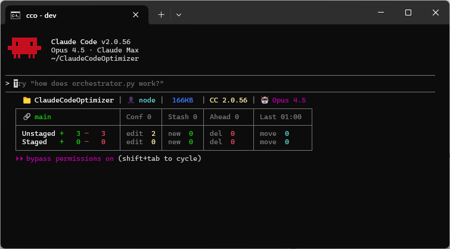

# ClaudeCodeOptimizer

[](https://pypi.org/project/claudecodeoptimizer/)
[](https://www.python.org/downloads/)
[](LICENSE)
[](https://github.com/anthropics/claude-code)

**Safety, quality, and decision layer for Claude Code.**

Same prompts, better outcomes. Fewer errors. Fewer surprises.

- Fewer incorrect changes
- Fewer rollbacks needed
- More consistent architectural decisions



## Why CCO?

| Without CCO                     | With CCO                                                  |
|---------------------------------|-----------------------------------------------------------|
| Claude applies generic patterns | Claude applies **domain-specific best practices**         |
| No pre-action safety checks     | Git status check, approval flow, clean state for rollback |
| Silent changes                  | `Applied: 5 | Skipped: 2 | Failed: 0` accounting          |
| "Add caching somewhere"         | "Use TTL + invalidation for this data fetch"              |

**CCO doesn't teach Claude to code** — Opus 4.5 already knows how. CCO adds the safety layer between intent and action.

## Quick Start

```bash
pip install claudecodeoptimizer && cco-install
```

Then in Claude Code:
```
/cco-config    # Detect your project, configure settings
```

**Done.** Your project now has safety nets and domain-specific rules active.

## How It Works

```
1. Detect    →  Auto-detect language, framework, infrastructure
2. Analyze   →  Identify issues, calculate impact
3. Approve   →  Safe changes auto-apply, risky ones require approval
4. Apply     →  Execute with full accounting
5. Verify    →  Confirm changes match intent
```

**Workflow:** Analyze → Report → Approve → Apply → Verify

## Who Is It For?

| Role                  | Benefit                                 |
|-----------------------|-----------------------------------------|
| **Solo developer**    | Safety net when moving fast             |
| **Senior engineer**   | Consistent patterns across AI sessions  |
| **Tech lead**         | Team-wide standards enforcement         |
| **AI-assisted teams** | Predictable, auditable AI behavior      |

## Safety Features

| Safe (auto-apply)       | Risky (require approval) |
|-------------------------|--------------------------|
| Remove unused imports   | Auth/CSRF changes        |
| Parameterize SQL        | DB schema changes        |
| Move secrets to env     | API contract changes     |

**Accounting:** Every action reports `Applied: N | Skipped: N | Failed: N`

<details>
<summary><b>Commands (8 available)</b></summary>

| Command          | Purpose                                        |
|------------------|------------------------------------------------|
| `/cco-config`    | Project setup: detection + settings + export   |
| `/cco-status`    | Health dashboard with scores                   |
| `/cco-optimize`  | Security + Quality + Hygiene fixes             |
| `/cco-review`    | Architecture analysis                          |
| `/cco-commit`    | Quality-gated atomic commits                   |
| `/cco-research`  | Multi-source research with reliability scoring |
| `/cco-preflight` | Pre-release workflow                           |
| `/cco-checkup`   | Regular maintenance                            |

See [Commands documentation](docs/commands.md) for flags and examples.

</details>

<details>
<summary><b>Rules System (1664 rules)</b></summary>

| Category | Count | When Loaded                     |
|----------|-------|---------------------------------|
| Core     | 73    | Always (fundamental principles) |
| AI       | 37    | Always (behavior patterns)      |
| Adaptive | 1554  | Per-project (stack-specific)    |

**Supported:** Python, TypeScript, Go, Rust, Java + 22 more languages • React, Vue, Django, FastAPI + 100 frameworks • Docker, K8s, Serverless • ML/AI, Game Dev, Blockchain

See [Rules documentation](docs/rules.md) for full reference.

</details>

<details>
<summary><b>Installation Options</b></summary>

**Requirements:** Python 3.10+ • Claude Code CLI or IDE • Zero runtime dependencies

```bash
# Standard
pip install claudecodeoptimizer && cco-install

# Isolated (pipx)
pipx install claudecodeoptimizer && cco-install

# Upgrade
pip install -U claudecodeoptimizer && cco-install

# Uninstall
cco-uninstall
```

### Local Mode

```bash
cco-install --local . --statusline cco-full --permissions balanced
```

| Option          | Values                                                    |
|-----------------|-----------------------------------------------------------|
| `--statusline`  | `cco-full` (all info) / `cco-minimal` (project + branch)  |
| `--permissions` | `safe` / `balanced` / `permissive` / `full`               |

</details>

## Standards

Built on [Claude 4 Best Practices](https://platform.claude.com/docs/en/build-with-claude/prompt-engineering/claude-4-best-practices) and official Claude Code documentation.

**Core:** SSOT, DRY, YAGNI, KISS • **AI:** Read-First, No-Hallucination • **Security:** OWASP, Least-Privilege

## Documentation

| Doc                          | Content                                  |
|------------------------------|------------------------------------------|
| [Commands](docs/commands.md) | All 8 commands with flags and examples   |
| [Agents](docs/agents.md)     | 3 specialized agents and their scopes    |
| [Rules](docs/rules.md)       | Full rule reference                      |

## License

MIT — see [LICENSE](LICENSE)

---

**[Issues](https://github.com/sungurerdim/ClaudeCodeOptimizer/issues)** • **[Changelog](CHANGELOG.md)** • Created by Sungur Zahid Erdim
